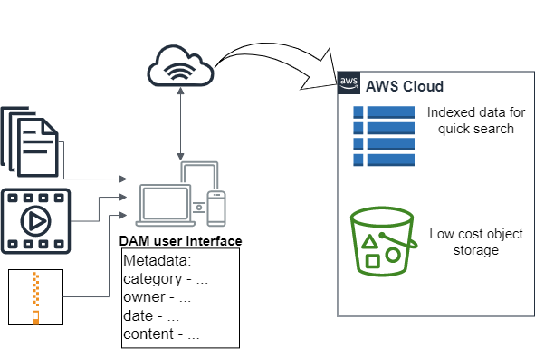
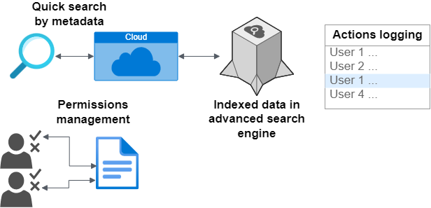
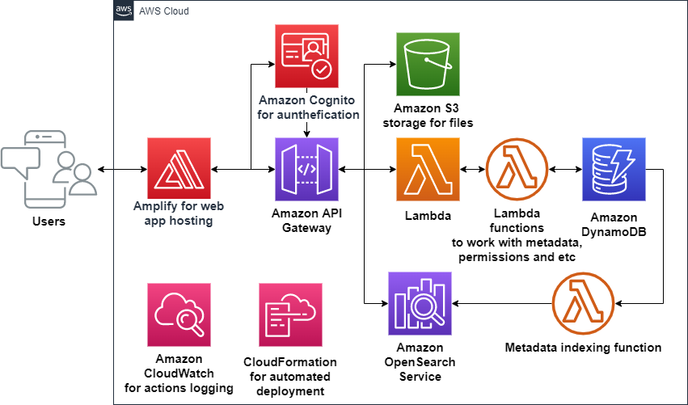
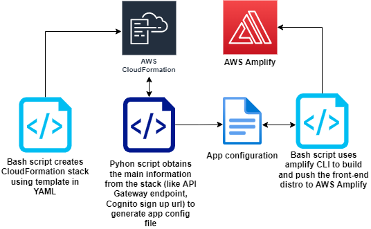

# Cloud-native Digital Asset Management System with automated deployment to AWS Cloud
Web application for storing, sharing your files in the cloud with advanced search engine, metadata and persmissions management.

## How To Deploy

In the root of the project folder:
1) install ***expect*** (bash)
2) `npm run deploy`
3) just wait until everything will be created

## Project description
During the operation of any enterprise, creating products for users, providing services to customers, a huge amount of diverse and heterogeneous data is generated and to efficiently manage it is a difficult task.

Digital Asset Management systems can provide companies with the ability to store all the data in the Cloud, work with metadata for quick and adjustable search mechanisms, control permissions. All of that is protected by the Cloud provider security with the new technologies like Serverless, Microservices and Infrastructure as code for automated deployment.

**Tools and languages used in this project:**
1. React with Typescript, React Redux for front-end.
2. AWS Serverless services for back-end (S3 storage, Lambda, API Gateway and etc).
3. CloudFormation with Python and Bash scripts to automate deployment.
4. OpenSearch as a search engine.

## **High-level overview**

## **Available actions**

## **AWS architecture**

## **Automated deployment process**

### The automated deployment scenario:

All AWS resources are defined in the CloudFormation template and configured as code.
The bash deployment script starts the CloudFormation stack creation.
As soon as the stack is ready, there are python scripts to obtain all the information from created AWS resources (like Gateway endpoint, login url from Cognito, and Amplify app id).

Then the process of Amplify application initialisation starts:
Scripts use headless commands in order to build the front-end part in Typescript and push the distro to AWS Amplify.

## Available Scripts

In the project directory, you can run:

### `npm start-webpack`

Builds and runs the app in the development mode.\
Open [http://localhost:9000](http://localhost:9000) to view it in the browser.

There will be no connection with the AWS cloud!\
So you will need to slightly change the code in order for it not to fetch data from the cloud.
